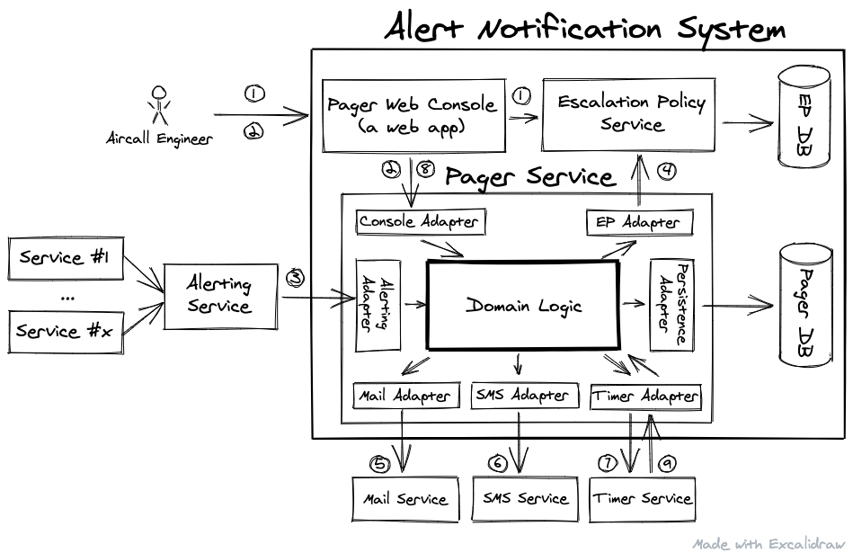

## Aircall Technical Test - Aircall Pager

With this solution we want to solve the problem proposed by Aircall and implement an alerting
and monitoring system called Pager Service.

The architecture design is:

## Development

This project was build using Python 8 because I have more experience with this language.

The structure of this project is: 

* All the code is in src package. In this package we can find all the classes and contain services, entities and adapters. All the code following the architecture
presented before.
* All the test are inside in test folder, I realize all test to check the main functionality. For this solution I used Python Unittest.
* Main file have an example of execution few calls.

## How to test it

You can execute all test in Python terminal or IDE and execute the file PagerServiceTest.py inside test folder.

## Assumptions

For a correct testing the code, I assume the following thinks:

* Requirements need to install in your Python Home or in your virtual environment.

* I assume the PagerDB is created, but not implement in this solution.

## Concurrency

For addressing challenges in the persistence layer is consistently handling operations in the database to uphold ACID principles and ensuring proper transaction management. Additionally, one could consider implementing a strategy for optimistic or pessimistic locking.